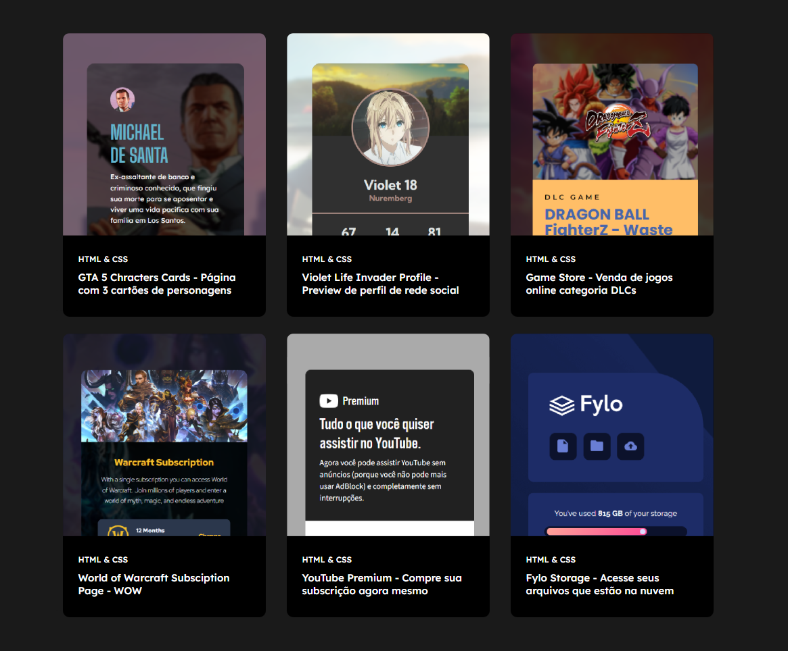
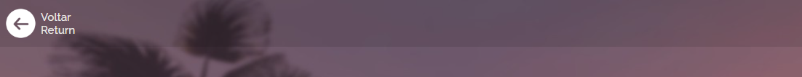
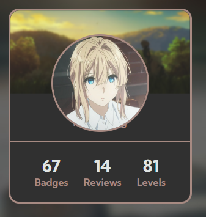
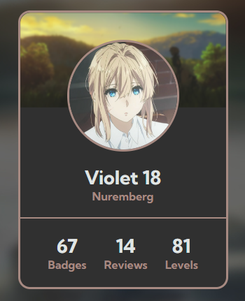
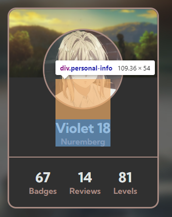

# Projeto com 6 projetos de HTML e CSS
### Projeto com 7 páginas/telas incluindo uma página principal que se redireciona para 6 projetos de HTML e CSS. 

- Página com 3 cartões trazendo informações
- Página de preview de perfil de rede social 
- Página de carrinho de site de venda de produtos
- Página com informações sobre preço de diferentes mensalidade
- Página de subscrição de produto
- Página de serviço de Armazenamento em Nuvem/Cloud 

[](https://benssssss.github.io/9-css-html-projects-2/)

[](https://github.com/benssssss/9-css-html-projects-2)

---

# Processo

## Design
### Design e layout feito usando pacote Adobe 

1 - Obter referência e layout

2 - Escolher tema e obter assets

3 - Escolher cores

---

Fylo Storage - Acesse seus arquivos
Página de serviço de Armazenamento em Nuvem/Cloud onde você pode guardar arquivos em quase todos os formatos como PDFs, DOCs, Fotos e videos. Crie sua conta agora mesmo

YouTube Premium - Compre sua subscrição agora mesmo
Página de subscrição de produto. Tudo o que você quiser assistir no YouTube. Sem interrupções. YouTube e YouTube Music off-line, sem anúncios e em segundo plano

Life Invader - Violet Profile
Página de preview de perfil de rede social, mostrando informações como quantidade de Badges, Reviews feitos, e nível da conta

Game Store - Compre aqui sua DLC - Seção de DLCs
Página de venda de jogos, mostrando na categoria DLCs, a nova DLC Season Pass 2 do jogo Dragon Ball FighterZ, trazendo novos 5 personagens para o seu jogo

Conclua sua compra - WOW - World of Warcraft Subsciption Section
Página com informações sobre preço de diferentes mensalidade e benefícios de cada classe da subscrição do jogo World of Warcraft

GTA 5 Chracters Cards - Cartão amostra triplo em coluna
Página com 3 cartões trazendo informações dos três personagens principais do jogo eletreonico Grand Theft Auto V (GTA V)

# Aprendizados

### Efeito transparente 
- Alterando opacidade com esquema de cores: RGBa 

```
.back-button {
    background-color: rgba(0, 0, 0, 0.1);
}
```


---

### Reduzir tamanho (mb) das imagens
- As imagens das páginas estavam demorando pra carregar, então comprimi todas as imagens contidas nos projetos, a maioria estava em PNG o que estava fazendo elas ficarem muito pesadas, converti todas as imagens possiveis para JPG e tive uma redução de 40% no geral 

---

### :Hover com Blur
- Primeira vez usando "filter: ;"

```
.picture {
    transition: 0.3s ease-in-out;
}

.picture:hover {
    filter: blur(2px);
}

```


---

### Formas geometricas

- Nunca havia usado formas geometricas, fiquei bastante perdido em como fazer esse triangulo invertido


[Link util](https://css-tricks.com/the-shapes-of-css/)

---

# O que eu gostaria de mudar 

## Página Life Invader - Violet Profile

- Gotaria de posicionar a foto redonda de uma maneira melhor, quando usei position nela e no cartão ela baixou e ficou encima do nome e localização, eu resolvi usando margin: top; mas tenho certeza que tem alguma maneira melhor de fazer isso 



```

.personal-info {
    margin-top: 8rem;
}

```



---


# Tecnologias utilizadas
- HTML5 Markup 
- CSS
- Clean Code
- Photoshop
- Illustrator

# Autor
### Jefferson Augusto (a.k.a Benssssss) 
## [LinkedIn](https://www.linkedin.com/in/benssssss/)

## Projeto n.º9
